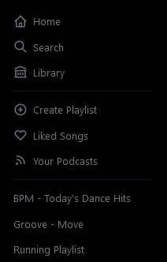
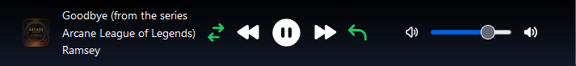
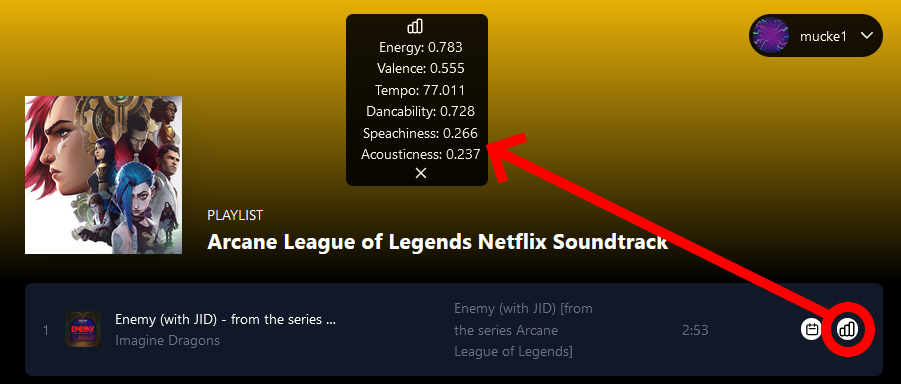
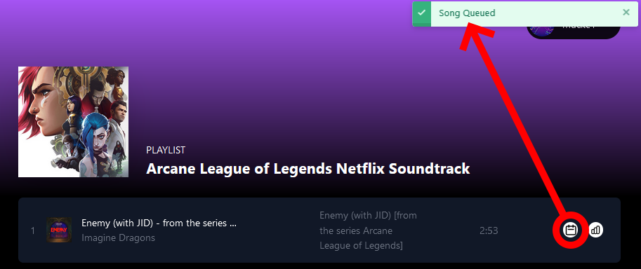
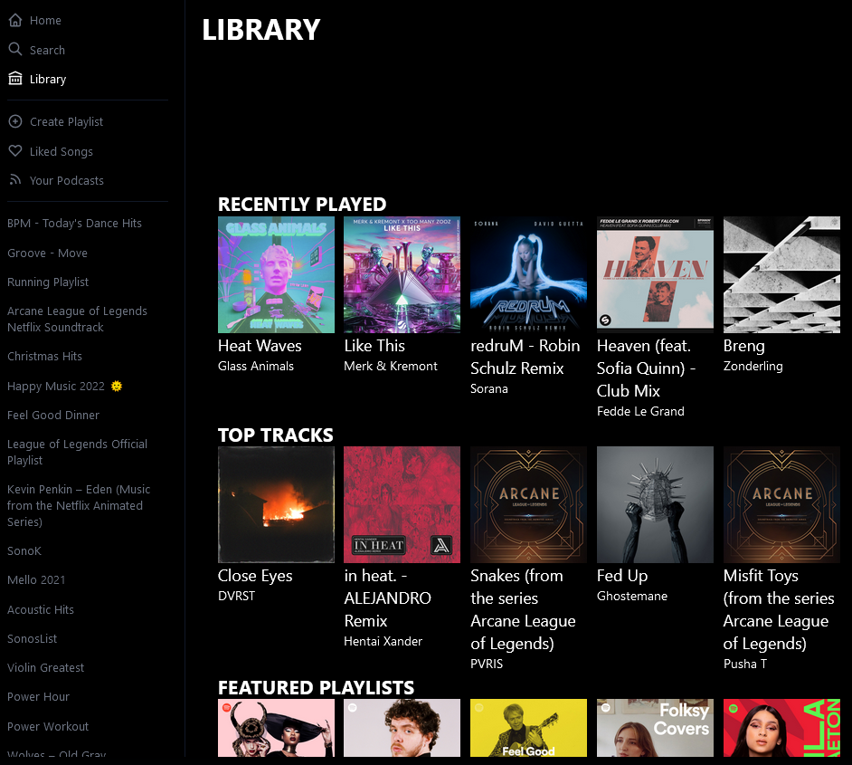
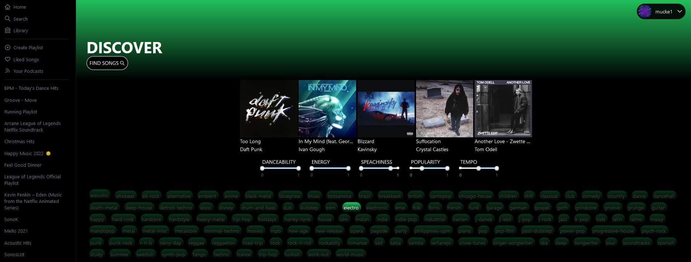
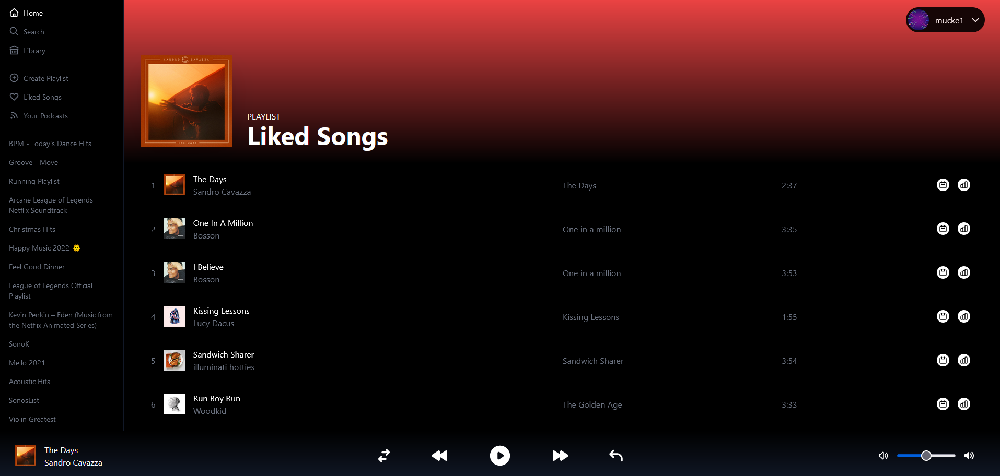
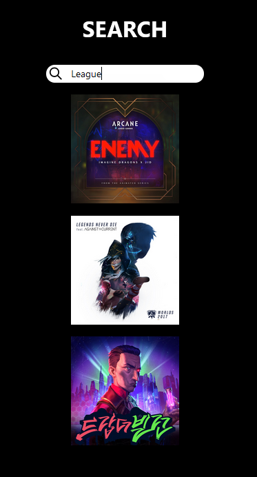
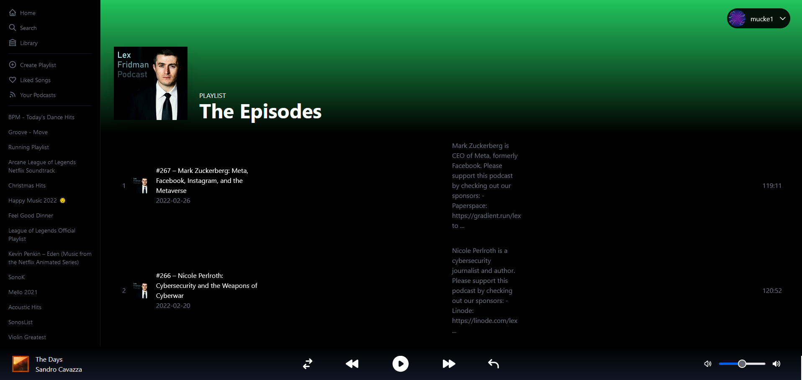

<h1>Spotify Boost</h1>

<h3>Preview Section</h3>

    
    

    
    

<h3><a href="https://spotify-boost.vercel.app/">Link to web app.</a> You need account specific credentials to sign in. Thus, you need to contact me to use the app.</h3>

## Specification:

- Next.js
- Tailwind
- Recoil
- NodeJS
- Cypress
- Jest
- React Testing Library (DOM node testing)
- Pre-commit git hooks
- React Query (caching, loading, refetching, error handling)

<h2>TDD:</h2>

- Step 1 - Write a failing test
- Step 2 - Make the test pass
- Step 3 - Refactor

* **Unit Tests** - focus on testing a specific unit or component, such as a function. It confirms that the function is built right. The unit test should be simple, easy implementation of code and should easily and quickly run, expecting a quick response.
* **Integration Tests** - focus on testing multiple “Units” together as a group.
* **System Tests** - focus on testing the complete software or product as a whole.

<h2>Cypress (Integration and end-to-end testing)</h2>

- End-to-end is simulated user behaviour in browser

- Given, When, Then syntax
